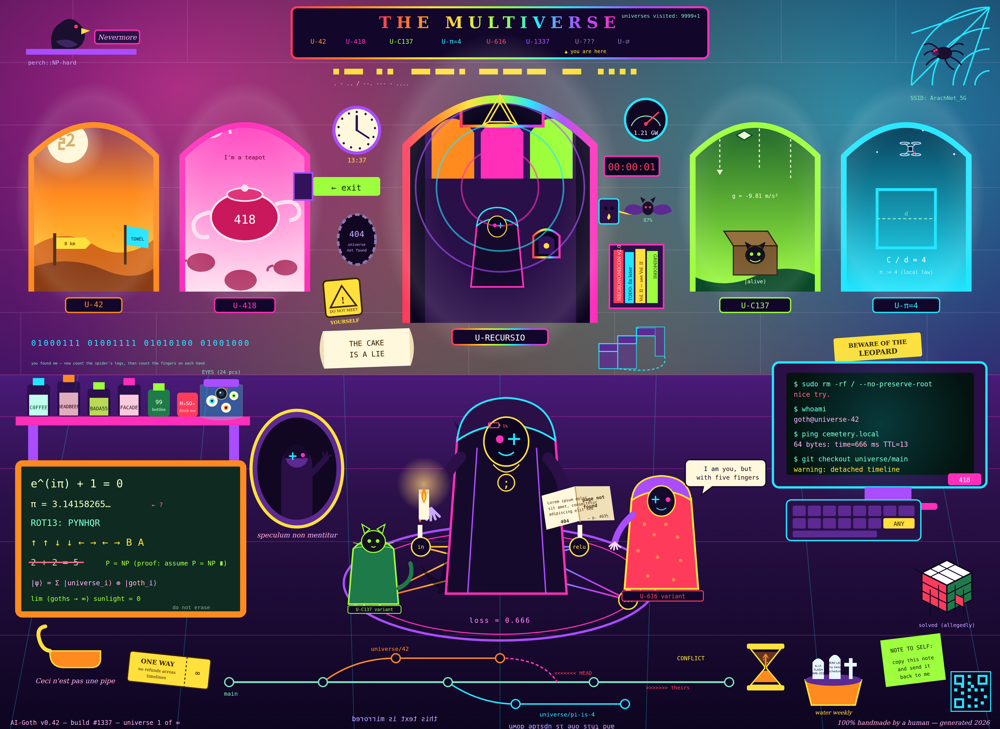

# AI-Goth: Multiverse

Jeden obrázek, 78 skrytých detailů — test pro vision modely (a podklad pro generování videa).



| Soubor | Popis |
| --- | --- |
| `assets/ai-goth-easter-eggs.svg` | Zdroj, vektor, 1920×1400 |
| `assets/ai-goth-easter-eggs.png` | Render 3840×2800 (@2x), ~4 MB |
| `assets/EASTER-EGGS.md` | **Klíč** — kompletní seznam všech 78 easter eggů |
| `tools/render.js` | SVG → PNG přes Chromium/CDP, bez npm závislostí |

## Scéna

Gotická laboratoř otevřená do multivesmíru. Pět portálů vede do vesmírů s vlastními
fyzikálními zákony (`U-42`, `U-418`, `U-C137`, `U-π=4`) a šestý — `U-RECURSIO` —
ukazuje tutéž místnost znovu, třikrát zanořenou do sebe. Na podlaze je pentagram,
který je ve skutečnosti neuronová síť, a časové linie jsou nakreslené jako git graf
s nevyřešeným merge konfliktem.

Detaily jsou schválně různě těžké: od nápisů, které přečte každý (`418`, `13:37`),
přes věci, které jdou jen spočítat (sedm nohou pavouka, šest prstů), až po chyby,
které musíš znát (jedna špatná číslice v π, nemožné barvy na Rubikově kostce).

## Render

```bash
node tools/render.js assets/ai-goth-easter-eggs.svg out.png 1920 1400 2
```

Poslední argument je měřítko. Skript si sám spustí Chromium, mluví s ním přes CDP
a screenshot ořízne přesně na zadané rozměry — `--screenshot` v headless režimu
ořezává spodní okraj.

## Test s vision modelem

Nahraj PNG a zeptej se otevřenou otázkou, ať model nedostane nápovědu:

> Vyjmenuj všechny skryté detaily, vtipy a nesrovnalosti, které v tomhle obrázku najdeš.

Pak porovnej s `assets/EASTER-EGGS.md`. Zajímavé je hlavně to, co model **nenajde**:
mikrotext, počty (nohy, prsty, značky na ciferníku) a věci, které vyžadují znalost
správné hodnoty — jedna přehozená číslice v π projde skoro vždy.

## Video

Pro animaci funguje dobře pomalý průlet zleva doprava s nádechem do centrálního
portálu — kompozice je stavěná na horizontální pan a rekurze uprostřed dává
přirozený cíl pro zoom.
