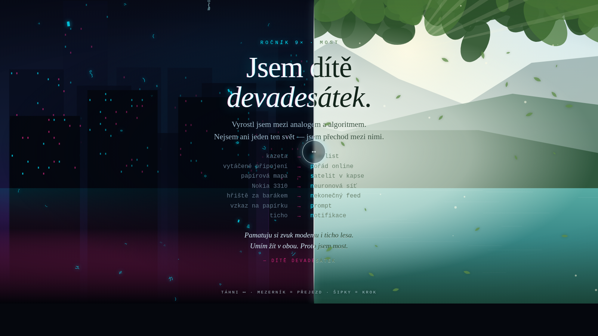

# MOST — dítě devadesátek

Osobní vizuální vyjádření: **jsem dítě devadesátek, most mezi starým a novým světem.**

Vlevo kyberpunkové město, vpravo les a jezero, uprostřed táhlo. Táhlem jezdíš mezi
světy a text se pod ním převléká.

## Hlavní myšlenka kódu

Obsah (nadpis, manifest, dvojice *staré → nové*, podpis) je napsaný **jen jednou**
v `<template>` a naklonovaný do obou světů. Oba světy proto sdílejí naprosto
stejnou geometrii — stejné písmo, stejné velikosti, stejné rozestupy. Liší se
**pouze barvou, stínem a dekorací**.

Díky tomu šev neposouvá text, ale jenom ho *osvětluje jinak*. Stejný člověk,
dvě světla. To je celý ten most — a je to zároveň jediné pravidlo, které se
nesmí porušit při dalších úpravách.

Druhá vrstva té myšlenky jsou částice: jedna a ta samá částice se vlevo vykresluje
jako datový glyf a vpravo jako list. V okamžiku, kdy proletí švem, zajiskří.
Nic se nevymění — jen přejde na druhý břeh.

## Soubory

| soubor | co to je |
|---|---|
| `index.html` | interaktivní verze, jeden soubor, nulové závislosti, funguje offline |
| `most-tisk.html` | zdroj tiskové verze (A4) |
| `most.pdf` | tisková verze — obálka, manifest, návod |
| `GEMINI-PROMPT.md` | hotové prompty na úpravy v Gemini |

## Ovládání

- **táhni myší / prstem** — posouváš most
- **mezerník** — zapne/vypne automatický přejezd
- **šipky ←→** — posun po krocích

Automatický přejezd běží sám, dokud se poprvé nedotkneš.

## Jak to spustit

Dvojklik na `index.html`. Nic víc — žádný build, žádný server, žádná knihovna,
žádné připojení k síti.

## Jak si to nechat upravit v Gemini

Nahraj `index.html` do Gemini (Canvas nebo AI Studio) a piš česky — proměnné,
třídy i komentáře v kódu jsou pojmenované česky, takže se dá popsat slovy, co
chceš jinak. Hotové zadání najdeš v `GEMINI-PROMPT.md`.

Nápady na pokračování:

- vyměnit dvojice *staré → nové* za vlastní vzpomínky
- přidat rok narození jako počítadlo, které běží od 199× do dneška
- ozvučit přejezd (modem vlevo, ptáci vpravo)
- svislý most místo vodorovného — svět nahoře a dole
- třetí svět: dětský pokoj z devadesátek jako vrstva uprostřed

## Technické poznámky

- vanilla HTML + CSS + JS, žádné závislosti
- pět `<canvas>` vrstev: statické pozadí obou světů, déšť kódu, sluneční paprsky
  s pylem a společná vrstva přecházejících částic
- pozice mostu je jediný stav — CSS proměnná `--p`, kterou čte `clip-path`
  i vykreslování částic
- respektuje `prefers-reduced-motion`: animace se vypnou a scéna zůstane
  vysázená napůl
